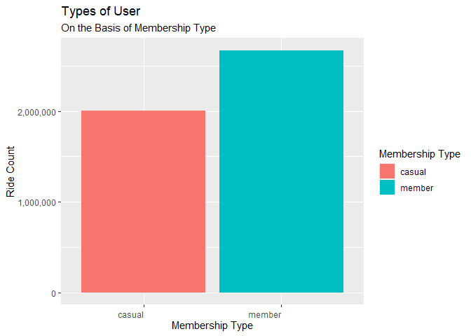
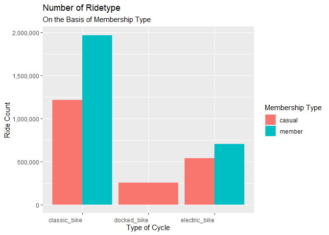
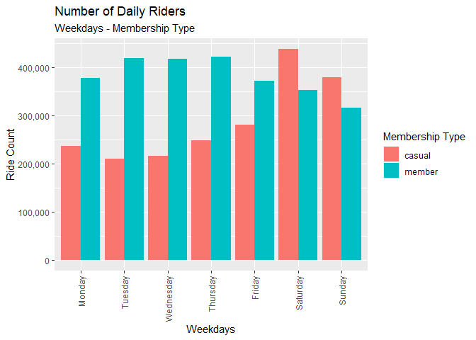
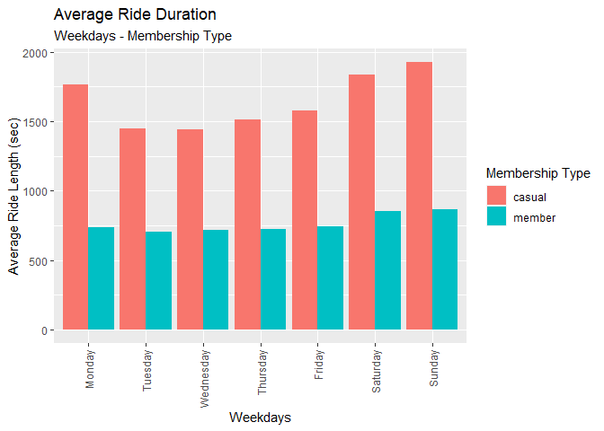
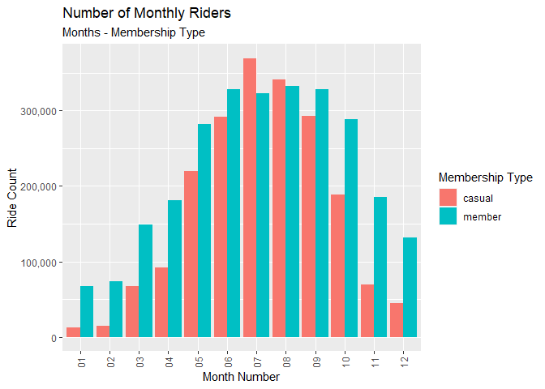
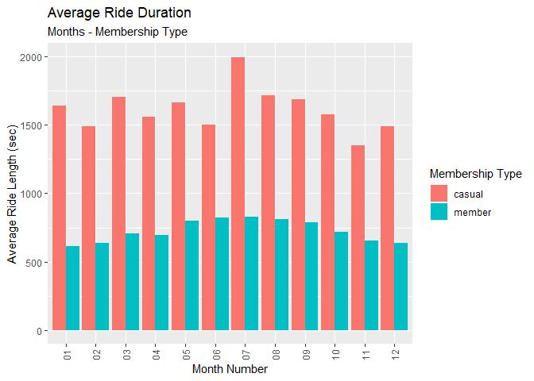

Cyclist Ride Data Analysis with R
================

## 1. Installing and Loading Packages

Following packages helps in smoothening the process of out analysis.

``` r
# load for data analysis and date-time
library("tidyverse")
library("lubridate")

# makes data cleaning task easier
library("here")
library("skimr")
library("janitor")
```

## 2. Collect Data

Downloaded the last 12 months dataset and stored the .csv file within
the following variables:

``` r
# load dataset
trips_2022_06 <- read_csv("trips_2022_06.csv")
trips_2022_05 <- read_csv("trips_2022_05.csv")
trips_2022_04 <- read_csv("trips_2022_04.csv")
trips_2022_03 <- read_csv("trips_2022_03.csv")
trips_2022_02 <- read_csv("trips_2022_02.csv")
trips_2022_01 <- read_csv("trips_2022_01.csv")
trips_2021_12 <- read_csv("trips_2021_12.csv")
trips_2021_11 <- read_csv("trips_2021_11.csv")
trips_2021_10 <- read_csv("trips_2021_10.csv")
trips_2021_09 <- read_csv("trips_2021_09.csv")
trips_2021_08 <- read_csv("trips_2021_08.csv")
trips_2021_07 <- read_csv("trips_2021_07.csv")
```

## Process Data to Analyze

First checking consistency in column names of the loaded dataframe. If
dataframes have varying column names, then, rename them - make them
consistence before creating a one-in-all dataframe by combining them
all.

``` r
# checking consistency in colnames
colnames(trips_2022_06)
colnames(trips_2022_05)
colnames(trips_2022_04)
colnames(trips_2022_03)
colnames(trips_2022_02)
colnames(trips_2022_01)
colnames(trips_2021_12)
colnames(trips_2021_11)
colnames(trips_2021_10)
colnames(trips_2021_09)
colnames(trips_2021_08)
colnames(trips_2021_07)
```

So all dataframe have the same column names, i.e, they are consistence.
Therefore, we can create a one-in-all dataframe by stacking one over
another. Hence, creating a dataframe with data of past 12 months.

Now, inspecting the dataframes and look for incongruencies using str()
command.

``` r
# checking structure of dataframes
str(trips_2022_06)
str(trips_2022_05)
str(trips_2022_04)
str(trips_2022_03)
str(trips_2022_02)
str(trips_2022_01)
str(trips_2021_12)
str(trips_2021_11)
str(trips_2021_10)
str(trips_2021_09)
str(trips_2021_08)
str(trips_2021_07)
```

Stacking the dataframe to create one-in-all dataframe.

``` r
# Stack individual month's data frames into one big data frame
all_trips <- bind_rows(trips_2022_06, trips_2022_05,
                       trips_2022_04, trips_2022_03,
                       trips_2022_02, trips_2022_01,
                       trips_2021_12, trips_2021_11,
                       trips_2021_10, trips_2021_09,
                       trips_2021_08, trips_2021_07)
```

Checking the structure of the one-in-all dataframe which we created
above under the variable **all_trips**.

``` r
str(all_trips)
```

    ## spec_tbl_df [5,900,385 × 13] (S3: spec_tbl_df/tbl_df/tbl/data.frame)
    ##  $ ride_id           : chr [1:5900385] "600CFD130D0FD2A4" "F5E6B5C1682C6464" "B6EB6D27BAD771D2" "C9C320375DE1D5C6" ...
    ##  $ rideable_type     : chr [1:5900385] "electric_bike" "electric_bike" "electric_bike" "electric_bike" ...
    ##  $ started_at        : POSIXct[1:5900385], format: "2022-06-30 17:27:53" "2022-06-30 18:39:52" ...
    ##  $ ended_at          : POSIXct[1:5900385], format: "2022-06-30 17:35:15" "2022-06-30 18:47:28" ...
    ##  $ start_station_name: chr [1:5900385] NA NA NA NA ...
    ##  $ start_station_id  : chr [1:5900385] NA NA NA NA ...
    ##  $ end_station_name  : chr [1:5900385] NA NA NA NA ...
    ##  $ end_station_id    : chr [1:5900385] NA NA NA NA ...
    ##  $ start_lat         : num [1:5900385] 41.9 41.9 41.9 41.8 41.9 ...
    ##  $ start_lng         : num [1:5900385] -87.6 -87.6 -87.7 -87.7 -87.6 ...
    ##  $ end_lat           : num [1:5900385] 41.9 41.9 41.9 41.8 41.9 ...
    ##  $ end_lng           : num [1:5900385] -87.6 -87.6 -87.6 -87.7 -87.6 ...
    ##  $ member_casual     : chr [1:5900385] "casual" "casual" "casual" "casual" ...
    ##  - attr(*, "spec")=
    ##   .. cols(
    ##   ..   ride_id = col_character(),
    ##   ..   rideable_type = col_character(),
    ##   ..   started_at = col_datetime(format = ""),
    ##   ..   ended_at = col_datetime(format = ""),
    ##   ..   start_station_name = col_character(),
    ##   ..   start_station_id = col_character(),
    ##   ..   end_station_name = col_character(),
    ##   ..   end_station_id = col_character(),
    ##   ..   start_lat = col_double(),
    ##   ..   start_lng = col_double(),
    ##   ..   end_lat = col_double(),
    ##   ..   end_lng = col_double(),
    ##   ..   member_casual = col_character()
    ##   .. )
    ##  - attr(*, "problems")=<externalptr>

## 3. Cleaning our Dataframe

### 3.1. Removing Irrelevant Columns

First task first, dropping all the irrelevant columns, which for us is
the start and end coordinates of the trip.

``` r
# dropping non-relevant columns
all_trips <- all_trips %>%  
  select(-c(start_lat, start_lng, end_lat, end_lng))
```

### 3.2. Adding New Columns

-   Add columns that list the date, month, day, and year of each ride

-   Now, we shall add columns that list the date, month, day and year of
    each ride. This will allow us to aggregate ride data for each month,
    day or year.

-   Before completing these operations we could only aggregate at the
    ride level.

``` r
all_trips$date <- as.Date(all_trips$started_at) #The default format is yyyy-mm-dd
all_trips$month <- format(as.Date(all_trips$date), "%m")
all_trips$day <- format(as.Date(all_trips$date), "%d")
all_trips$year <- format(as.Date(all_trips$date), "%Y")
all_trips$day_of_week <- format(as.Date(all_trips$date), "%A")
```

Now to get the duration a ride we will substract the end and start time
and add a column **ride_length** for the same.

``` r
all_trips$ride_length <- difftime(all_trips$ended_at,all_trips$started_at)
```

### 3.3. Delete Rows will Null Values

Delete rows with NA values and where the ride duration came out to be
negative.

``` r
all_trips_v2 <- na.omit(all_trips)
all_trips_v2 <- all_trips_v2[!(all_trips_v2$ride_length < 0),]
```

### 3.4. Arranging Weekdays

Arrange weekdays in serial order.

``` r
all_trips_v2$day_of_week <- ordered(all_trips_v2$day_of_week, level = c("Monday", "Tuesday", "Wednesday", "Thursday", "Friday", "Saturday", "Sunday"))
```

## 4. Analysis Stage

Descriptive analysis of ride length (sec).

``` r
mean(abs(all_trips$ride_length)) #straight average (total ride length / rides)
```

    ## Time difference of 1217.01 secs

``` r
median(abs(all_trips$ride_length)) #midpoint number in the ascending array of ride lengths
```

    ## Time difference of 670 secs

``` r
max(abs(all_trips$ride_length)) #longest ride
```

    ## Time difference of 2946429 secs

``` r
min(abs(all_trips$ride_length)) #shortest ride
```

    ## Time difference of 0 secs

### 4.1. Type of Users

``` r
# Make the plot
ggplot(all_trips_v2, aes(x = member_casual, fill = member_casual)) +
     geom_bar() +
  labs(x = "Membership Type", y = "Ride Count", fill = "Membership Type", title = "Types of User", subtitle = "On the Basis of Membership Type") +
  theme(axis.text.x = element_text(vjust = 0.5, hjust=1)) +
  scale_y_continuous(labels = scales::comma)
```

<!-- -->

Clearly, there are two types of users where users with membership are
more than casual riders by about *62,500*.

### Ride Type Analysis

``` r
ggplot(all_trips_v2, aes(x = rideable_type, fill = member_casual)) +
  geom_bar(position = "dodge") +
  labs(x = "Type of Cycle", y = "Ride Count", fill = "Membership Type", title = "Number of Ridetype", subtitle = "On the Basis of Membership Type") +
  theme(axis.text.x = element_text(vjust = 0.5, hjust=1)) +
  scale_y_continuous(labels = scales::comma)
```

<!-- -->

Users ride *classic bike* more often than the other ride type. Docked
Bike are only taken by *casual riders*.

### Ride Analysis with Weekdays

``` r
ggplot(all_trips_v2, aes(x = day_of_week, fill = member_casual)) +
  geom_bar(position = "dodge") +
  labs(x = "Weekdays", y = "Ride Count", title = "Number of Daily Riders", subtitle = "Weekdays - Membership Type", fill = "Membership Type") +
  theme(axis.text.x = element_text(angle = 90, vjust = 0.5, hjust=1)) +
  scale_y_continuous(labels = scales::comma)
```

<!-- -->

``` r
all_trips_v2 %>% 
  group_by(member_casual, day_of_week) %>% 
  summarize(number_of_rides = n(),
            average_duration = mean(ride_length)) %>% 
  arrange(member_casual, day_of_week) %>% 
  ggplot(aes(x = day_of_week, y = average_duration, fill = member_casual)) +
  geom_col(position = "dodge") +
  labs(x = "Weekdays", y = "Average Ride Length (sec)", title = "Average Ride Duration", subtitle = "Weekdays - Membership Type", fill = "Membership Type") +
  theme(axis.text.x = element_text(angle = 90, vjust = 0.5, hjust = 1))
```

<!-- -->

# Ride Analysis with Months

``` r
ggplot(all_trips_v2, aes(x = month, fill = member_casual)) +
  geom_bar(position = "dodge") +
  labs(x = "Month Number", y = "Ride Count", title = "Number of Monthly Riders", subtitle = "Months - Membership Type", fill = "Membership Type") +
  theme(axis.text.x = element_text(angle = 90, vjust = 0.5, hjust=1)) +
  scale_y_continuous(labels = scales::comma)
```

<!-- -->

Number of riders increases in the month of *May to Oct*, i.e, in summer.

``` r
all_trips_v2 %>% 
  group_by(member_casual, month) %>% 
  summarize(number_of_rides = n(),
            average_duration = mean(ride_length)) %>% 
  arrange(member_casual, month) %>% 
  ggplot(aes(x = month, y = average_duration, fill = member_casual)) +
  geom_col(position = "dodge") +
  labs(x = "Month Number", y = "Average Ride Length (sec)", title = "Average Ride Duration", subtitle = "Months - Membership Type", fill = "Membership Type") +
  theme(axis.text.x = element_text(angle = 90, vjust = 0.5, hjust = 1))
```

<!-- -->
